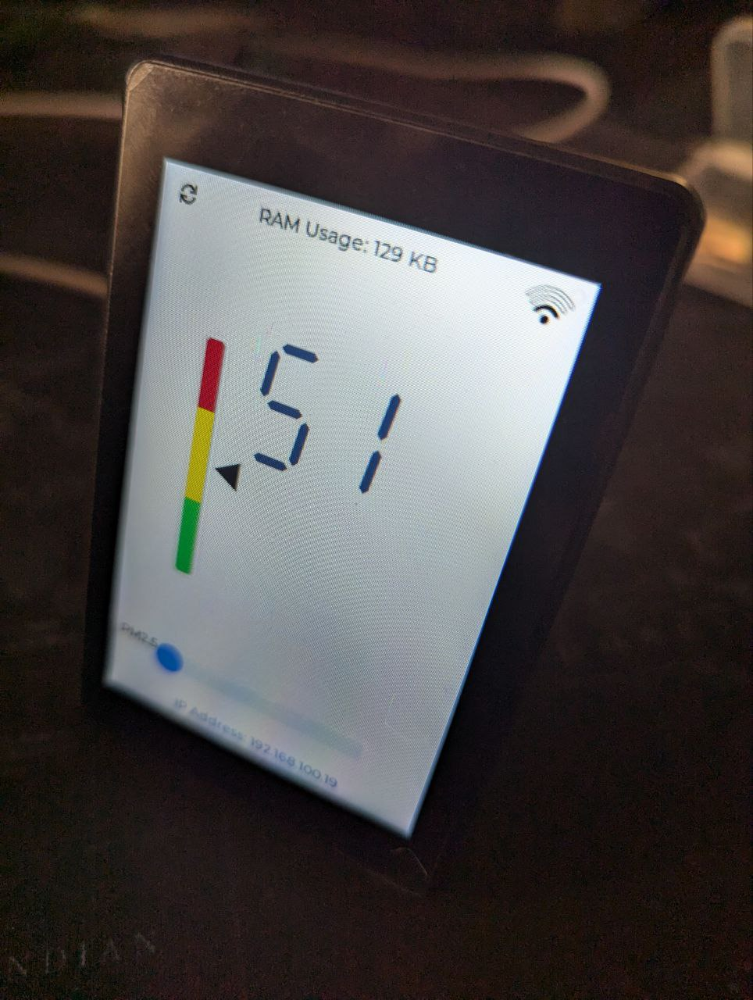
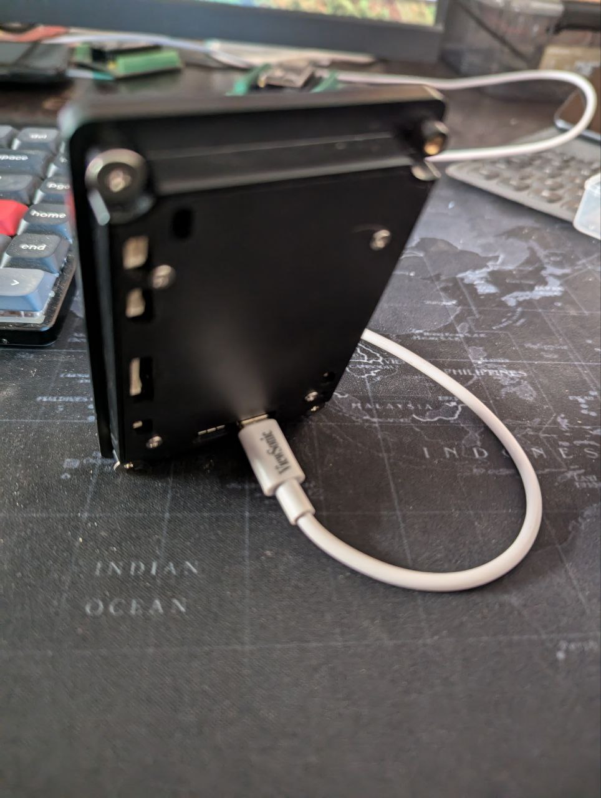

# MicroPython LCD Display Project

This project demonstrates how to use a JC3248W535 LCD display with MicroPython.

## Hardware

We're using the JC3248W535 LCD display, which is compatible with MicroPython. This display offers a good balance of size and resolution for embedded projects.




The JC3248W535 is a versatile LCD that can be easily integrated with MicroPython-capable microcontrollers like ESP32.

## Features
- ESP32-S3 3.5-inch capacitive touch IPS module 8M PSRAM 16M 320*480
- Compatible with MicroPython
- Model: JC3248W535
- LCD: axs15231b QSPI
- TOUCH: axs15231b I2C

## Pin info

```
## Panel

# LCD_QSPI_HOST           (SPI2_HOST)     SPI2_HOST=1,  ok

# PIN_NUM_QSPI_CS         (GPIO_NUM_45)                 ok
# PIN_NUM_QSPI_PCLK       (GPIO_NUM_47)                 ok

# PIN_NUM_QSPI_DATA0      (GPIO_NUM_21)                 ok
# PIN_NUM_QSPI_DATA1      (GPIO_NUM_48)                 ok
# PIN_NUM_QSPI_DATA2      (GPIO_NUM_40)                 ok
# PIN_NUM_QSPI_DATA3      (GPIO_NUM_39)                 ok

# PIN_NUM_QSPI_RST        (GPIO_NUM_NC)                 NC
# PIN_NUM_QSPI_DC         (GPIO_NUM_8)                  ok
# PIN_NUM_QSPI_TE         (GPIO_NUM_38)
# PIN_NUM_QSPI_BL         (GPIO_NUM_1)                  ok

## Touch

# I2C_NUM                     (I2C_NUM_0)               ok
# I2C_CLK_SPEED_HZ            400000                    ok

# PIN_NUM_QSPI_TOUCH_SCL  (GPIO_NUM_8)                  ok
# PIN_NUM_QSPI_TOUCH_SDA  (GPIO_NUM_4)                  ok
# PIN_NUM_QSPI_TOUCH_RST  (-1)
# PIN_NUM_QSPI_TOUCH_INT  (-1)

```

## Progress

- Firmware: https://github.com/lvgl-micropython/lvgl_micropython/
- https://github.com/lvgl-micropython/lvgl_micropython/discussions/161
