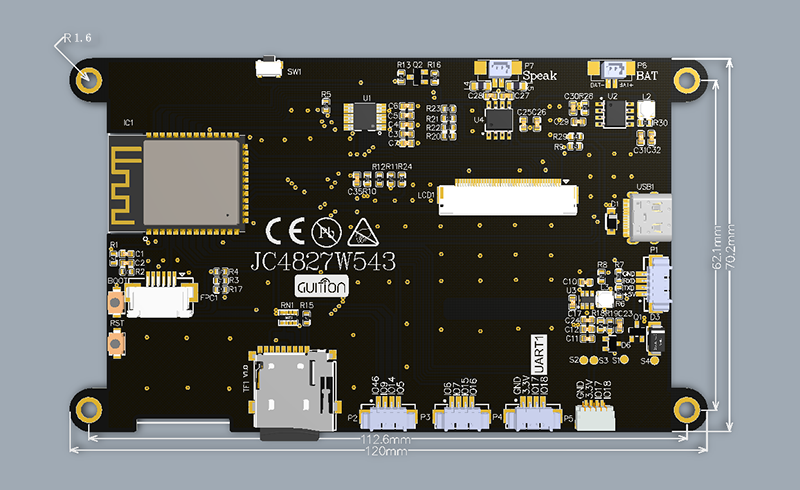
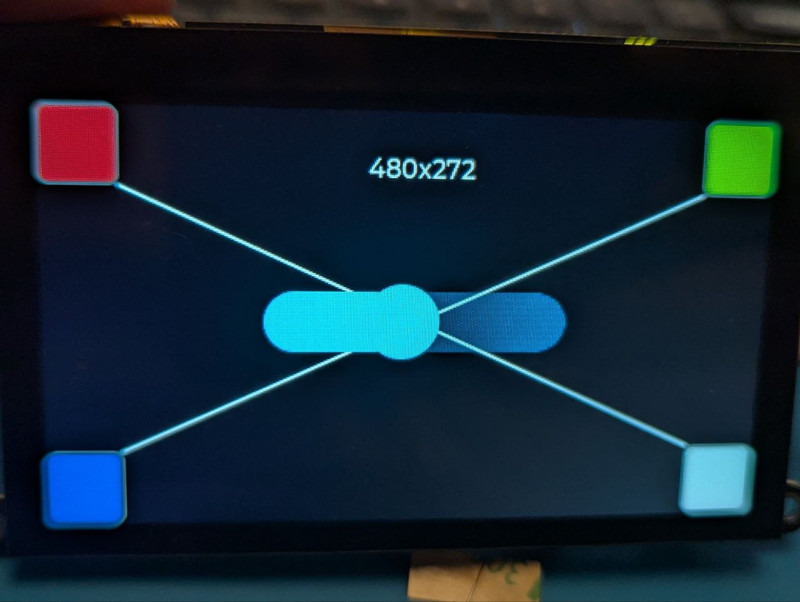

# MicroPython LCD Display Project

This project demonstrates how to use a LCD display with LVGL MicroPython.

Kevin G. Schlosser: 
- https://github.com/lvgl-micropython/lvgl_micropython

## Hardware

### JC3248W535

 Features
- ESP32-S3 3.5-inch capacitive touch IPS module 8M PSRAM 16M 320*480
- Compatible with MicroPython
- Model: JC3248W535
- LCD: axs15231b QSPI
- TOUCH: axs15231b I2C

We're using the JC3248W535 LCD display, which is compatible with MicroPython. This display offers a good balance of size and resolution for embedded projects.

For detailed information about this display, see the [JC3248W535 how to](./device/JC3248W535/README.md).

### JC4827W543

 Features
- ESP32-S3 4.3-inch capacitive touch IPS module 8M PSRAM 4M 480*270
- Compatible with MicroPython
- Model: JC4827W543
- LCD: NV3041A QSPI
- TOUCH: GT911 I2C

JC4827W543_board
ESP32-S3 with 4.3' TFT 480x270 driver NV3041A and capacitive GT911

For detailed information about this display, see the [JC4827W543 how to](./device/JC4827W543/README.md).

